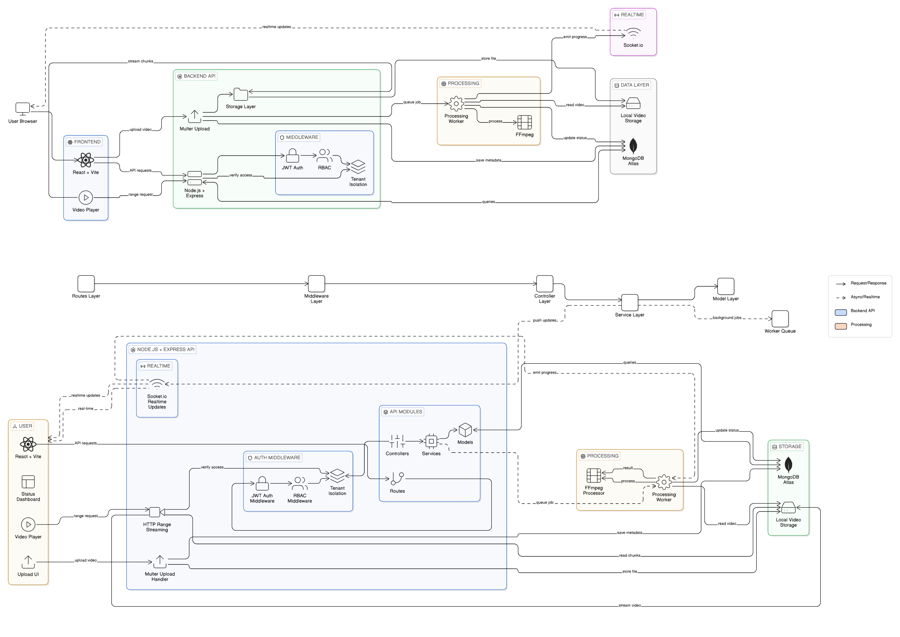

# ⚡ Pulse — Real-Time Video Processing & Delivery Platform



> **A comprehensive micro-architectured platform built to securely process multi-tenant video uploads, administer algorithmic sensitivity analysis natively through decoupled job workers, and pipe real-time streaming telemetry across isolated WebSockets.**

---

# Demo Video
[](https://drive.google.com/file/d/12meZyYxUuVBv2Ng00sjj7V5gOGFv7Mnm/view?usp=sharing)

*This application was architected symmetrically emphasizing strict Role-Based Access Controls (RBAC), multi-tenant data boundaries, and deeply unified state observability.*

---

## 🏗️ Architecture Overview

1. **Deterministic Processing Pipelines (Worker Decoupling)**
   Instead of blocking the primary Node.js Event Loop by processing large video streams physically inside Express route boundaries, the system immediately delegates `multer` buffered payloads down to a native secondary `Worker Queue`. The `fluent-ffmpeg` pipeline wraps natively over `ffprobe` binaries asynchronously injecting sequence milestones back out via `event-emitter` buses.
2. **Tenant-Isolated WebSocket Rooms (Observability)**
   Socket.io is wrapped strictly down to multi-tenant namespaces. When a worker broadcasts `processingProgress` for Video ID `X`, the backend only emits back to users joined specifically into `Tenant::[ID]` rooms securely.
3. **HTTP 206 Partial Content Streaming Engine**
   Standard HTTP delivery methods break down drastically matching >100MB MP4 blobs. Pulse builds explicit `fs.createReadStream` bridges interpreting web-client `Range: bytes=XX-` headers explicitly dispatching chunked payload segments allowing raw, immediate, zero-latency `<video>` seek-buffering gracefully on the frontend.
4. **State Management Synchronization**
   The React SPA wraps an agnostic Context API (`VideoContext.jsx`) globally exposing the WebSocket interceptors. Real-time background `updateVideoState` mutations trigger isolated DOM paint changes specifically updating Badges (`Pending -> Processing`) instantly without massive interval `useEffect` polling.

---

## 🧠 Assumptions and Design Decisions

1. **Storage-First Abstraction Strategy**
   Assumption: The local MVP requires testing videos locally but must scale.  
   Decision: Architecture isolates file I/O operations strictly behind `StorageProvider.js`. Although mapped resolving local `uploads/` directories trees natively initially, the abstraction enables 10-minute S3/Cloud bucket implementations through polymorphic overrides, leaving the Controllers totally untouched.
2. **Deterministic Sensitivity Analysis Model**
   Assumption: Real-world ML API pipelines (like AWS Rekognition) introduce significant latency and costs for a demo project.  
   Decision: A simulated but purely deterministic model isolates videos perfectly. Strict policy states videos `≤ 30s` length drop immediately into a `flagged` block restricting specific roles natively. Videos `> 30s` pass as `safe`.
3. **Multi-Tenant JWT RBAC Scoping**
   Assumption: Checking MongoDB on every single request constraint introduces heavy bottlenecks.  
   Decision: Token scopes (`role`, `tenantId`) are statically encoded into the JSON Web Token. Express endpoints organically decode roles (`Viewer`, `Editor`, `Admin`) without triggering heavy `$match` Database aggregation lookups natively on route guard policies.
4. **Zero-Trust Invite Protocols**
   Assumption: Users joining via open Invite Links should not inherently inherit destructive capabilities.  
   Decision: New users mapping into complex multi-tenant organizations strictly enter with the `Viewer` constraint by default. Escalation physically requires Admin manual updates.

---

## 🗂️ Folder Structure

```text
Pulse/
├── backend/
│   ├── .env.example
│   ├── package.json
│   ├── server.js              # Server entrypoint & Socket.io initialization
│   └── src/
│       ├── app.js             # Express app setup and middleware
│       ├── config/            # DB configuration and environment variables
│       ├── controllers/       # Route business logic (auth, video, admin)
│       ├── middleware/        # RBAC, Authentication, and dynamic Error handlers
│       ├── models/            # Restricted Mongoose schemas (User, Tenant, Video)
│       ├── routes/            # Express routers
│       ├── services/          # Core architectural abstractions and database queries
│       ├── sockets/           # WebSocket broadcast and interceptor handlers
│       ├── storage/           # Storage Providers polymorphic abstraction layer
│       └── workers/           # Asynchronous Node-native FFmpeg processing queues
├── frontend/
│   ├── package.json
│   ├── vercel.json            # Vercel SPA 404-bypass rewrite rules
│   ├── vite.config.js         # Vite bundler configuration
│   └── src/
│       ├── components/        # Reusable UI elements (StatusBadges, RoleGates)
│       ├── hooks/             # Custom React Socket.io listener bindings
│       ├── pages/             # Dynamic Views (Library, Admin, Upload, Player)
│       ├── services/          # Axios HTTP proxy instances & Socket definitions
│       ├── store/             # Global React Context API Providers
│       ├── App.jsx            # Application Router definition
│       └── index.css          # Core Design System, Animations, and Glassmorphism 
└── README.md
```

---

## 📘 User Manual

**1. Creating a Workspace (Admin)**
- Navigate to `/register`.
- Enter your overarching Organization Name along with your Account credentials.
- You are immediately dropped into the unified Dashboard as the primary Tenant Admin.

**2. Inviting Team Members**
- Given Admin scope, navigate to the **Admin Panel** (`/admin`).
- Click "Copy" next to the Invite Link string natively generated. Let your team members browse this link directly. 
- You can revoke compromised links securely utilizing the overarching rotation mechanics explicitly inside that menu.

**3. Uploading & Tracking Jobs**
- (Requires `Editor` or `Admin` role scopes). Go to the Upload module. 
- Drop a video file (under 500MB). Upon redirect back to the Dashboard, DO NOT REFRESH. You will seamlessly observe the WebSockets natively updating the Processing progression `%` values live as FFprobe analyzes vectors locally.

**4. Filtering Advanced Library Variables**
- Navigate to the **Library Module**. Use the 4 dynamic parameter dropdowns to filter payloads across `Status`, `Date Thresholds (24h/7d)`, `Size Increments`, and granular `Durations`.

**5. Viewing Sensitivity Bounded Resources**
- Videos that were classified as `flagged` are completely scrubbed away from `Viewer` roles traversing grids.
- `Admin / Editors` will notice an explicit Gate block UI ("Sensitivity Warning") upon clicking flagged videos requiring manual acknowledgement before pipeline streams initiate correctly resolving Policy C compliance.

---

## ⚙️ Installation and Setup Guide

### Prerequisites
- Node.js `v18+` or `v20+` is heavily recommended.
- Free MongoDB Atlas Cluster URI natively pointing to read-write privileges.

*(Note: Because this platform installs `ffmpeg-static` globally across the backend natively, you do **not** need to install OS-dependent binary implementations natively across your system variables!)*

### Startup Pipeline
```bash
# Clone the repository
git clone https://github.com/rounakbharti/pulse-video-platform.git
cd pulse-video-platform

# Term 1: Initialize Core Backend Services
cd backend
npm install
# Configure your environment parameters
copy .env.example .env
# Edit inside .env, ensuring you map MONGODB_URI and JWT_SECRET uniquely!
npm run dev

# Term 2: Initialize Client Interface
cd frontend
npm install
npm run dev
```

---

## 💻 Technology Stack

| Layer | Technology | Execution Overview |
|-------|------------|--------------------|
| **Frontend** | React 18, Vite | Rapid HMR, strict React Context API hooks cleanly handling states dynamically. |
| **Styling** | Vanilla CSS | Bespoke control building flawless Dark-Mode Glassmorphism styling mapped directly into 600+ robust utility classes. |
| **Backend** | Node.js, Express.js | Core Rest APIs cleanly partitioned avoiding massive singular route definitions. |
| **Database** | MongoDB Atlas, Mongoose | Flexible NoSQL logic handling natively parsing Compound Indices mapped against `tenantId`. |
| **Auth** | JWT, bcryptjs | Stateless auth tokens signed securely against bcrypt salts mitigating global enumeration scaling attacks natively. |

---

## 📡 API Documentation 

> Prefix all route paths strictly against: `http://localhost:5000/api` natively extracting `Authorization: Bearer <token>` conditionally.

### Security Module (`/auth`)
- `POST /register` : Create Org + Baseline Admin user securely.
- `POST /join` : Accepts encrypted `inviteCode` binding new nodes cleanly as `Viewer` tenants natively.
- `GET  /invite/:code` : Inspect and resolve encrypted URI links returning Org data correctly.
- `POST /login` : Issue state-tokens based on bcrypt checks securely resolving Tenant access natively.

### Media Pipeline (`/videos`)
- `POST /upload` : Resolves `multipart/form-data` logic instantly dumping `201 Accepted` yielding to downstream background workers cleanly.
- `GET  /` : Native aggregate endpoints resolving complex params natively (`limit`, `safetyStatus`, `dateFilter`, `durationFilter`, `sizeFilter`) filtered dynamically per Tenant.
- `GET  /:id/stream` : Translates active read buffers back across Express responding strictly mapping natively bounded `HTTP 206 Partial Headers`. 
- `DELETE /:id` : (Admin/Editor scoped identically). Tears out DB Document Mapping instances matching local file purging.

### Administration (`/admin`)
- `GET  /users` : Map overarching array of downstream tenant hierarchies natively.
- `PUT  /users/:id/role` : Secure cross-escalation scopes natively binding restrictions stopping overarching Admin demotion errors securely.
- `POST /invite/rotate` : Instantly nukes historical static hex tokens safely mapping new entry links cleanly returning dynamic UUID bounds.
